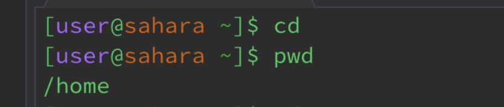
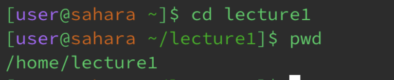
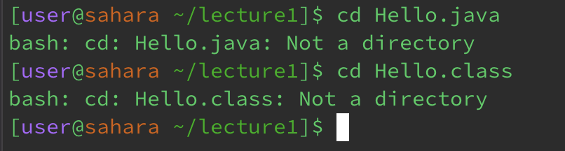
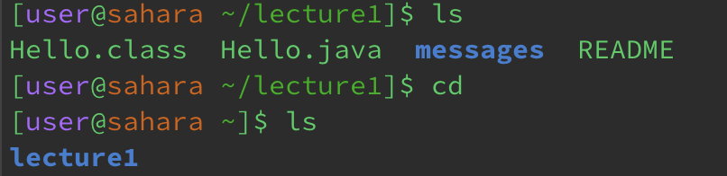
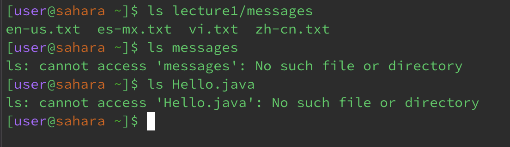
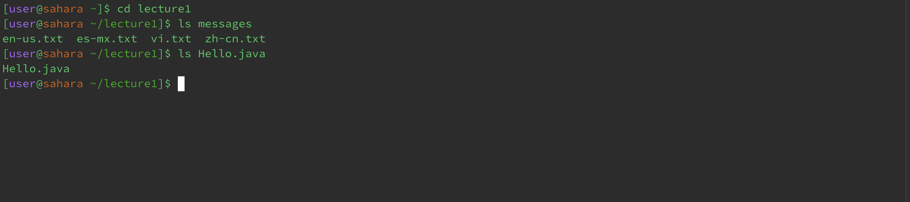
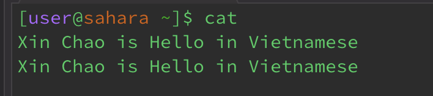
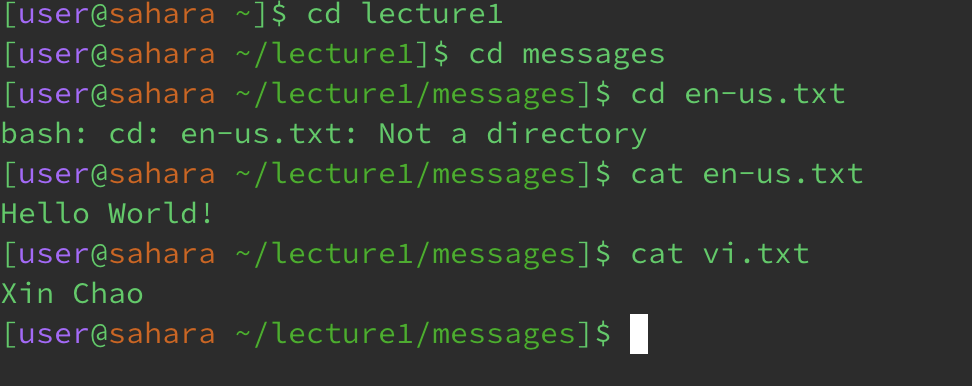
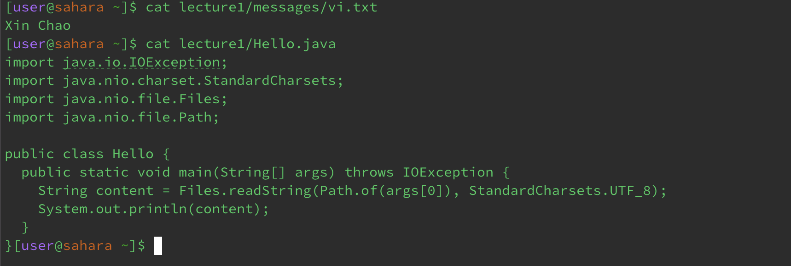
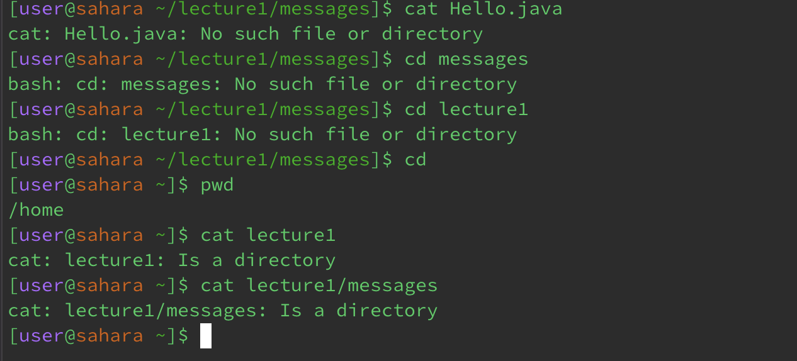

# LAB REPORT 1
# Name: Duong Ngo
# Professor: Joe Gibss Politz

* Using command `cd` :

1. Using the command with no arguments:
if given no argument, the `cd` command will direct us to the given path, in this case the given path is * home written as /home. In this case, the default path is `home`, so whenver we use `cd` 
command with no argument, it will direct us to `home` directory as shown below.

2. Using the command with a path to a directory as an argument:
If given a directory as an argument, the `cd` command will direct us that path that we passed it as an argument. In this case, I want to go to the `lecture1` path, I will pass `cd` with argument `lecture1` and use `pwd` to know which directory we are at. As shown below, `pwd` command show us 
that we are currently in `lecture1` directory. 

3. Using the command with a path to a file as an argument:
if given a file as an argument, the `cd` command will report an error with a message shown below. It is because `Hello.java` or `Hello.class`
are not directory, they are files so the `cd` command cannot use them to direct us. 

* Using command `ls`

1. Using the command with no arguments:
if given no argument, the `ls` will defaultly list all the files in the directory that we currently in. In the image shown below, `ls` command will list 
all the files and directories in `lecture1`. And then I use `cd` with no argument to go back default path which is `home`, and use the command `ls` to see what files and directories are in `home`. As a result, `lecture1` is listed the directory in `home`. Generally, passing no argument for `ls` command is listing what files and directories of the current path we are in, in this case which is `lecture1`. 

2. Using the command with arguments: 
Instead of using `cd` to go to a certain directory and then list them, we can directly use `ls` command with argument and the argument here is a directory that we want to access. In the image shown below, I use `cd` and pass `lecture1` as an argument so it will list all the files and directories in `lecture1`.

3. Using the command with a path to a file: 
* In the image shown below, `ls` command will report an error showing that it only can list directories, not files. In this case, when using `ls` with argument `Hello.java`, it will say `Hello.java` is not a directory so it cannot list. Also, even `messages` is a directory, we cannot use `ls` directly. We can using command `ls` to `lecture1` directory first, and then go to `messages` directory and then we can use command `ls` to see what files in `messages`. 

* In another case, when I tried to use `cd` to access to `lecture1` directory, it will lead me to `lecture1` directory. Then, I will use `ls` command passing the argument `Hello.java` and it listed a file name `Hello.java` as the image shown below.
* 

* Using command `cat`

1. Using the command  `cat` with no arguments:
When using command `cat` with no argument, it will let us create or edit the text that we want to type and display the text in the terminal itself. As shown in the image below, we don't have to create a certain text file when we can type it in the terminal.

2. Using the command `cat` with arguments:
When using the command `cat` with arguments, it should show us the message of a file inside a certain directory. In the image shown below, I use the command `cat` to display the text inside the file `vi.txt` and `en-us.txt`. In order to get out of the texting state or exit the running program, we will use `Control C` as in Mac OS (my computer in this case) to exit.  

3. Using the command `cat` with a path to a file:
When using the command `cat` with a path to a file, there will be some cases happened shown in the image below. The command can display a file if we direct it to that file. For example, in the image, it will display the `vi.txt` and `Hello.java` if directed in the correct directory. However, if we just use command `cat` for a directory, it will only display the message `lecture1`: Is a directory or messages: Is a directory.

